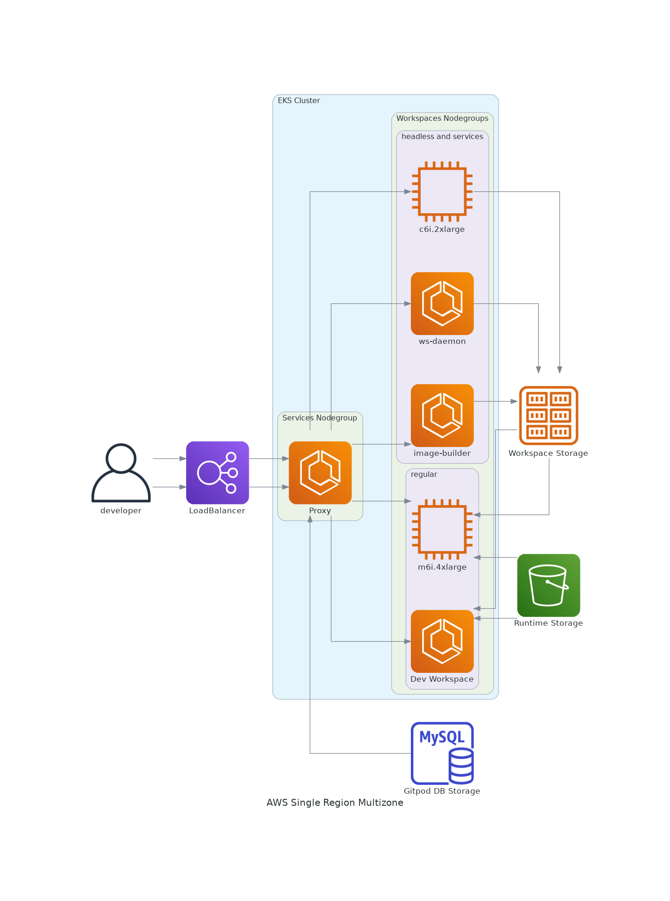

# gitpod-reference-alpha

This is a POC repo meant to illustrate how we can generate guide material around different architectures.

It uses python package ["diagrams"](https://diagrams.mingrammer.com/) to render the visual you see below.

## Basic EKSCTL driven example

Using the provided gitpod-cluster.yml and eksctl, you can provision a basic EKS cluster with the baseline dependencies for a self contained installation. This does not use any external dependencies at the moment, so should be considered a throw away environment. 

If you do use ACME certificates and Route53, it will require additional steps for DNS configuration outside the scope of this document.

The steps are:
- Provision EKS Cluster without nodegroups
- Remove AWS Networking and replace with Calico CNI for higher pod capacity
- Provision EKS Cluster's nodegroups
- Install certificate manager, with adjustments provided to work with Calico in EKS
- Run Replicated installation procession for Gitpod


### Create Cluster
`eksctl create cluster --config-file gitpod-cluster.yaml --without-nodegroup`

update kubeconfig : `aws eks update-kubeconfig --name lab`

### Install Calico
To ensure the cluster is deployed only so you can then install calico
```bash
# remove existing aws setup and install calico
kubectl delete ds aws-node -n kube-system
kubectl apply -f https://docs.projectcalico.org/manifests/calico-vxlan.yaml
```

### Create node groups
```
eksctl create nodegroup --config-file gitpod-cluster.yaml --include workspace
```

### Install Cert-manager
install cert-manager, with hostport:true, fsGroup:1001
```
kubectl cert-manager x install --namespace cert-manager --set installCRDs=true \
    --set webhook.hostNetwork=true --set serviceAccount.name='cert-manager' --set serviceAccount.create='false' \
    --set webhook.securePort=10260
```
Edit deployment for fsGroup setting

### Install kots (Replicated) and Gitpod
```
curl https://kots.io/install | bash
kubectl kots install gitpod -n gitpod
```

## diagrams

https://diagrams.mingrammer.com/docs/getting-started/installation


