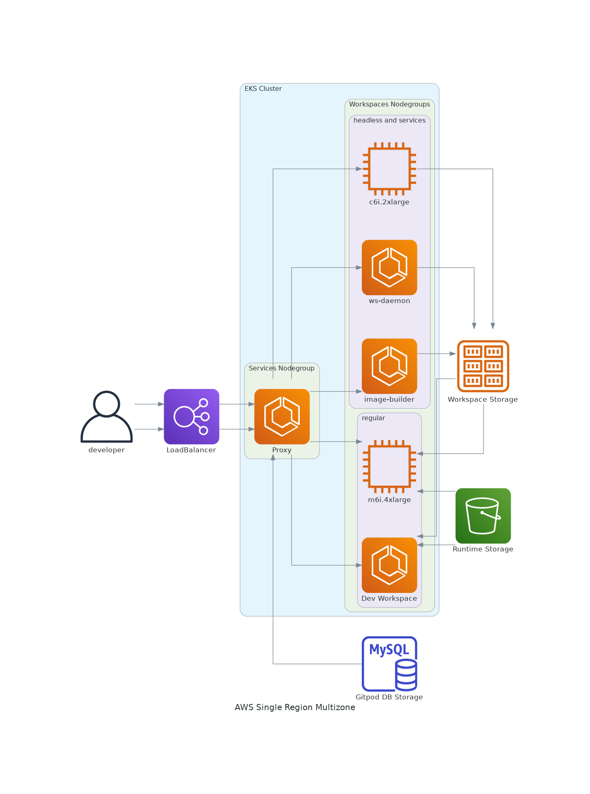

# Amazon based Gitpod installations

## Design Considerations

It is suggested to use Amazon services where possible for better integration with their platform.

### Database 
RDS (currently with user/password auth support)

### Registry

ECR is not yet supported, but currently Gitpod self hosted can provision an S3 backed container registry to use

### Object Storage

EFS or S3 depending on future design decisions. The current S3 implementation is under revision and may change.

## Examples

### Multizone installation

This is a three nodegroup cluster. The roles are split:
- Services: Supporting services, the Gitpod web interface, proxies that connect to ELBs, etc. These are the smallest footprint services, so need smaller instances but will run for long periods of time to ensure continuity of services.
- Workspace Building: Services specifically related to coordinating, building, and pushing the container images that make up a users runtime experience. These machines handle arbitary code and can have push access to registries, object stores, etc. Like CI job runners, they are used when a user launches a workspace, and if prebuilding is enabled, where the prebuild actions are running. This nodegroup will see the most dramatic spikes in usage when supporting teams of standard 9-5 business hours (heaviest launching of instances in the morning, slowing down throughout the day).
- Workspace Runtimes: Active workspace containers running here, providing the backend servers for developer IDEs. Can be the most resource intensive and where performance degradition can become most notable, because everyone hates a slow cursor. Some techniques such as scheduled scale up/down of this group may be suggested if there's strict business hours of operation already in place.

This is an [eksctl example](eksctl.md) that does the very basic deployment of two node groups (Services and Workspaces), using the eksctl's built in addon support for most things such as IAM roles and service accounts.

## diagrams

